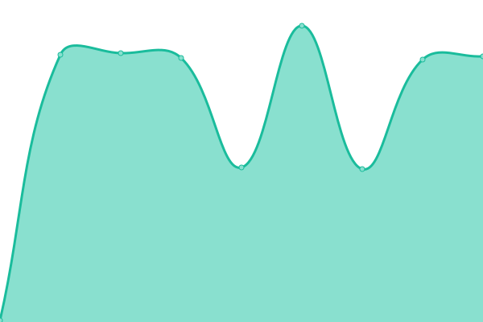

# [📈 Live Status](https://monitoring.ucloud4schools.de): <!--live status--> **🟩 All systems operational**

This repository contains the open-source uptime monitor and status page for [Upptime](https://upptime.js.org), powered by [Upptime](https://github.com/upptime/upptime).

With [Upptime](https://upptime.js.org), you can get your own unlimited and free uptime monitor and status page, powered entirely by a GitHub repository. We use [Issues](https://github.com/upptime/upptime/issues) as incident reports, [Actions](https://github.com/julio1501/uptime/actions) as uptime monitors, and [Pages](https://demo.upptime.js.org) for the status page.

<!--start: status pages-->
<!-- This summary is generated by Upptime (https://github.com/upptime/upptime) -->
<!-- Do not edit this manually, your changes will be overwritten -->
<!-- prettier-ignore -->
| URL | Status | History | Response Time | Uptime |
| --- | ------ | ------- | ------------- | ------ |
|  Identity Provider | 🟩 Up | [identity-provider.yml](https://github.com/julio1501/uptime/commits/HEAD/history/identity-provider.yml) | 

 872ms
     
 | 

<a href="https://monitoring.ucloud4schools.de/history/identity-provider">100.00%</a>
    

|  ucloud4schools | 🟩 Up | [ucloud4schools.yml](https://github.com/julio1501/uptime/commits/HEAD/history/ucloud4schools.yml) | 

 1983ms
     
 | 

<a href="https://monitoring.ucloud4schools.de/history/ucloud4schools">100.00%</a>
    

|  Plesk Webmailer | 🟩 Up | [plesk-webmailer.yml](https://github.com/julio1501/uptime/commits/HEAD/history/plesk-webmailer.yml) | 

 756ms
     
 | 

<a href="https://monitoring.ucloud4schools.de/history/plesk-webmailer">100.00%</a>
    

|  LMS4schools | 🟩 Up | [lms-4schools.yml](https://github.com/julio1501/uptime/commits/HEAD/history/lms-4schools.yml) | 

 1064ms
     
 | 

<a href="https://monitoring.ucloud4schools.de/history/lms-4schools">100.00%</a>
    

|  utalk4schools | 🟩 Up | [utalk4schools.yml](https://github.com/julio1501/uptime/commits/HEAD/history/utalk4schools.yml) | 

 1135ms
     
 | 

<a href="https://monitoring.ucloud4schools.de/history/utalk4schools">100.00%</a>
    

|  Plesk SMTPS | 🟩 Up | [plesk-smtps.yml](https://github.com/julio1501/uptime/commits/HEAD/history/plesk-smtps.yml) | 

 167ms
     
 | 

<a href="https://monitoring.ucloud4schools.de/history/plesk-smtps">100.00%</a>
    

|  Plesk IMAPS | 🟩 Up | [plesk-imaps.yml](https://github.com/julio1501/uptime/commits/HEAD/history/plesk-imaps.yml) | 

 125ms
     
 | 

<a href="https://monitoring.ucloud4schools.de/history/plesk-imaps">100.00%</a>
    

|  DEMO | 🟩 Up | [demo.yml](https://github.com/julio1501/uptime/commits/HEAD/history/demo.yml) | 

 706ms
     
 | 

<a href="https://monitoring.ucloud4schools.de/history/demo">100.00%</a>
    

<!--end: status pages-->

## 📄 License

- Powered by: [Upptime](https://github.com/upptime/upptime)
- Code: [MIT](./LICENSE) © [Upptime](https://upptime.js.org)
- Data in the `./history` directory: [Open Database License](https://opendatacommons.org/licenses/odbl/1-0/)
